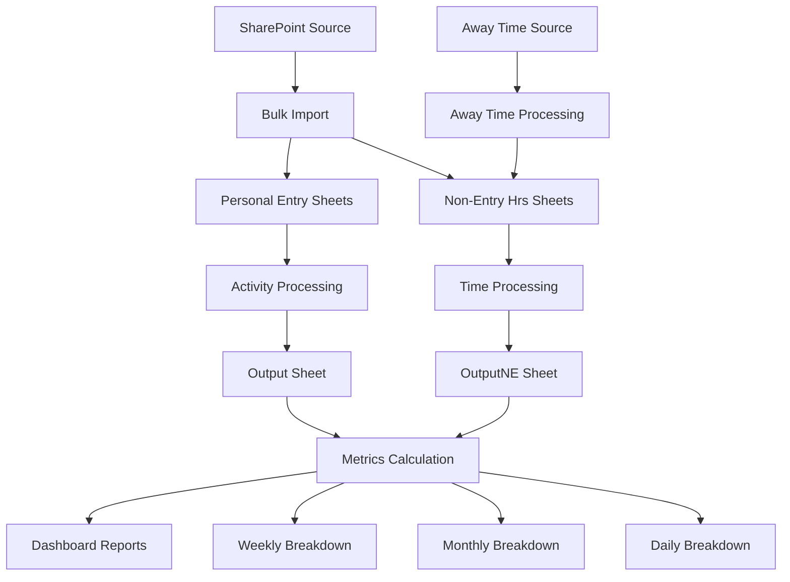

# Team Productivity Tracker

A robust, modular VBA-based Excel solution for tracking, analyzing, and reporting team productivity. This system automates data import from SharePoint/network sources, supports incremental and bulk processing, and generates detailed productivity reports with configurable targets and metrics.

---

## 🚀 Key Features

- **Automated Data Import**: Bulk and incremental import from SharePoint/network sources, with intelligent catch-up for missing workdays.
- **Incremental Output Updates**: Only processes and updates output for newly imported or changed dates, making daily runs extremely fast.
- **Configurable Metrics**: Set daily targets, sick/away day parameters, and productivity thresholds via the Config sheet.
- **Multi-Level Reporting**: Generates daily, weekly, and monthly productivity breakdowns with color-coded performance indicators.
- **Away Time Integration**: Processes sick/vacation time to calculate adjusted productivity metrics.
- **Bulk Historical Processing**: Efficiently processes large date ranges for onboarding or backfilling data.
- **Template Management**: Automated monthly sheet creation from templates.
- **Regional Support**: Automatic region categorization (BC, AB, CT, ON, QC, MT, YK, AR).
- **Performance Optimizations**: Uses array operations, disables screen updating, and minimizes worksheet interaction for speed.

---

## 📁 Project Structure

```
TeamProductivity/
├── MasterImportAndRunAll.bas          # Main orchestration, import, and reporting engine
├── DataProcessing.bas                 # Core data transformation and output logic
├── CreateMonthlySheetsFromTemplates.bas # Template-based monthly sheet creation
├── PersonalEntryBulkRunner.bas        # Bulk processing for "Personal Entry" data
├── NonEntryBulkRunner.bas             # Bulk processing for "Non-Entry Hrs" data
├── ProcessAwayTime.bas                # Away time processing (basic)
├── ProcessAwayTime_SelectDestination.bas # Away time processing (advanced, with file selection)
└── README.md                          # This file
```

---

## 🏗️ Architecture Overview

### Core Modules

#### `MasterImportAndRunAll.bas`
- `Master_ImportAndRunAll()`: Main entry point. Handles performance optimizations, determines missing dates, performs bulk import, and triggers incremental or full reporting.
- `BulkImportDataForDates()`: Opens the source workbook once and imports all missing dates in a single session.
- `CalculateProductivityMetrics()`: Rebuilds or incrementally updates output and report sheets based on which dates were imported.
- `NeedsImport()`: Fast check to determine if a date needs importing.
- Helper functions for sorting, info sheet updates, and error handling.

#### `DataProcessing.bas`
- `ProcessActivitySheet()`: Processes "Personal Entry" activity data, including region categorization and productivity calculations.
- `ProcessNonEntrySheet()`: Processes "Non-Entry Hrs" time tracking data.
- `ParseDateFromName()`: Utility for extracting dates from sheet names.

#### `CreateMonthlySheetsFromTemplates.bas`
- `CreateMonthlySheetsFromTemplates()`: Creates monthly sheets for all workdays using templates.
- `SheetExists()`: Prevents duplicate sheet creation.

### Bulk Processing Modules

#### `PersonalEntryBulkRunner.bas`
- `BulkProcessLastYear()`: Processes 18 months of "Personal Entry" data.

#### `NonEntryBulkRunner.bas`
- `BulkProcessNonEntryLastYear()`: Processes 18 months of "Non-Entry Hrs" data.

### Away Time Processing

#### `ProcessAwayTime.bas`
- `ProcessAwayTime_WithDetailedLogging()`: Basic away time processing for the current workbook.

#### `ProcessAwayTime_SelectDestination.bas`
- `ProcessAwayTime_SelectDestinationFile()`: Advanced away time processing with file selection.

---

## 📊 Data Flow



---

## ⚙️ Configuration

### Required Sheets

- **Config**: Holds all key parameters (source path, targets, sick/away categories, etc.)
- **ActivityLookup**: Maps task names to AHT and metadata.
- **Personal Entry** and **Non-Entry Hrs**: Template sheets for new day creation.

### Key Config Parameters

- `Config_SourceWorkbookPath`: SharePoint URL for source data
- `Config_DailyTargetHours`: Daily productivity target (e.g., 6.5)
- `Config_HoursPerSickDay`: Hours per sick/away day (e.g., 7.5)
- `Config_SickAwayCategories`: Range of sick/away category names
- `Config_NonProductiveTasks`: Range of non-productive task names

---

## 🏃‍♂️ Running the System

### Daily Operations

```vba
Call Master_ImportAndRunAll
```
- Imports only missing workdays since the last processed date.
- Only updates output and reports for new/changed dates.

### Monthly Sheet Creation

```vba
Call CreateMonthlySheetsFromTemplates
```

### Bulk Historical Processing

```vba
Call BulkProcessLastYear
Call BulkProcessNonEntryLastYear
```

### Away Time Processing

```vba
Call ProcessAwayTime_WithDetailedLogging
Call ProcessAwayTime_SelectDestinationFile
```

---

## 📈 Reports Generated

- **Productivity Dashboard**: Monthly team summary with color-coded performance.
- **Monthly Breakdown**: Individual monthly stats.
- **Weekly Breakdown**: Week-by-week analysis.
- **Daily Breakdown**: Day-by-day details, including adjusted workday factors.

---

## 🎨 Visual Indicators

- 🟢 Green: ≥ 100% of target
- 🟡 Yellow: 90–99% of target
- 🔴 Red: < 90% of target

---

## 🛠️ Maintenance & Troubleshooting

- All configuration is externalized to Excel sheets.
- Debug logging via `Debug.Print` throughout the codebase.
- Performance optimizations: disables screen updating, uses arrays and dictionaries, minimizes worksheet interaction.

---

## 📋 Sheet Naming Conventions

- **Personal Entry**: `Personal Entry M-D-YY`
- **Non-Entry Hrs**: `Non-Entry Hrs M-D-YY`
- **Output Sheets**: "Output", "OutputNE"
- **Report Sheets**: "ProductivityDashboard", "MonthlyBreakdown", "WeeklyBreakdown", "DailyBreakdown"

---

## 🤝 Contributing

- Maintain naming conventions and error handling.
- Add debug logging for new features.
- Update this README and code comments with any changes.
- Test with sample data before production use.

---

*This system is designed for scalability and maintainability. All configuration is externalized to Excel sheets, making it easy to adapt to different teams or requirements without code changes.*
