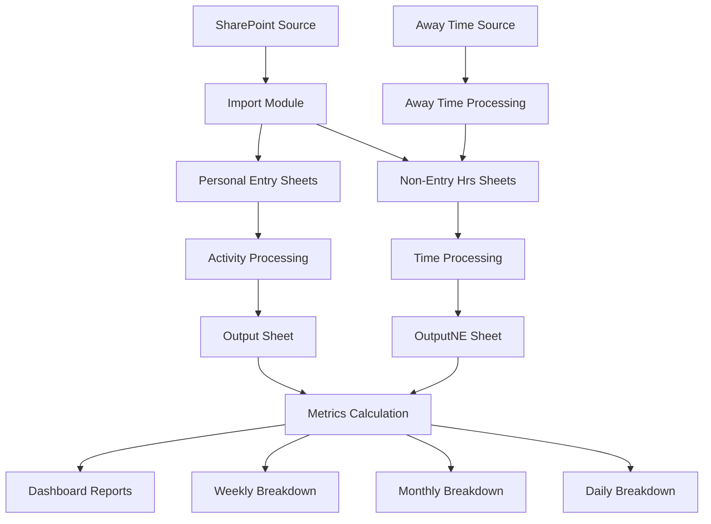

# Team Productivity Tracker

A comprehensive VBA-based Excel solution for tracking, analyzing, and reporting team productivity across multiple workbooks and time periods. This system automates data import from SharePoint/network sources and generates detailed productivity reports with configurable targets and metrics.

## 🚀 Features

- **Automated Data Import**: Intelligent catch-up functionality imports data from remote workbooks
- **Dual Processing System**: Handles both activity-based ("Personal Entry") and time-based ("Non-Entry Hrs") data
- **Configurable Metrics**: Set daily targets, sick/away day parameters, and productivity thresholds
- **Multi-Level Reporting**: Daily, weekly, and monthly productivity breakdowns with visual indicators
- **Away Time Integration**: Processes sick/vacation time to calculate adjusted productivity metrics
- **Bulk Processing**: Historical data processing across multiple months
- **Template Management**: Automated monthly sheet creation from templates
- **Regional Support**: Multi-region task categorization (BC, AB, CT, ON, QC, MT, YK, AR)

## 📁 Project Structure

```
TeamProductivity/
├── MasterImportAndRunAll.bas          # Main orchestration and reporting engine
├── DataProcessing.bas                 # Core data transformation functions
├── CreateMonthlySheetsFromTemplates.bas # Template-based sheet creation
├── PersonalEntryBulkRunner.bas        # Bulk processing for activity data
├── NonEntryBulkRunner.bas             # Bulk processing for time tracking data
├── ProcessAwayTime.bas                # Away time processing (basic)
├── ProcessAwayTime_SelectDestination.bas # Away time processing (advanced)
└── README.md                          # This file
```

## 🏗️ Architecture Overview

### Core Modules

#### [`MasterImportAndRunAll.bas`](MasterImportAndRunAll.bas)
**Main Control Module**
- `Master_ImportAndRunAll()`: Primary execution subroutine with intelligent catch-up
- `ImportDataForDate()`: Date-specific data import from remote SharePoint sources
- `CalculateProductivityMetrics()`: Comprehensive reporting and analysis engine

#### [`DataProcessing.bas`](DataProcessing.bas)
**Data Transformation Engine**
- `ProcessActivitySheet()`: Processes "Personal Entry" activity data with regional categorization
- `ProcessNonEntrySheet()`: Processes "Non-Entry Hrs" time tracking data
- `ParseDateFromName()`: Utility function for extracting dates from sheet names

#### [`CreateMonthlySheetsFromTemplates.bas`](CreateMonthlySheetsFromTemplates.bas)
**Template Management**
- `CreateMonthlySheetsFromTemplates()`: Creates monthly sheets for weekdays only
- `SheetExists()`: Helper function to prevent duplicate sheet creation

### Bulk Processing Modules

#### [`PersonalEntryBulkRunner.bas`](PersonalEntryBulkRunner.bas)
- `BulkProcessLastYear()`: Processes 18 months of "Personal Entry" sheets

#### [`NonEntryBulkRunner.bas`](NonEntryBulkRunner.bas)
- `BulkProcessNonEntryLastYear()`: Processes 18 months of "Non-Entry Hrs" sheets

### Away Time Processing

#### [`ProcessAwayTime.bas`](ProcessAwayTime.bas)
- `ProcessAwayTime_WithDetailedLogging()`: Basic away time processing with current workbook

#### [`ProcessAwayTime_SelectDestination.bas`](ProcessAwayTime_SelectDestination.bas)
- `ProcessAwayTime_SelectDestinationFile()`: Advanced version with file selection capabilities

## 📊 Data Flow



## ⚙️ Configuration

The system requires several Excel sheets for configuration:

### Required Sheets

1. **Config Sheet**
   - `Config_SourceWorkbookPath`: SharePoint URL for source data
   - `Config_DailyTargetHours`: Daily productivity target (e.g., 6.5 hours)
   - `Config_HoursPerSickDay`: Hours per sick/away day (e.g., 7.5 hours)
   - `Config_SickAwayCategories`: Range containing sick/away category names

2. **ActivityLookup Sheet**
   - Column A: Task names
   - Column B: Average Handle Time (AHT) in minutes
   - Column C: Additional metadata

3. **Template Sheets**
   - `Personal Entry`: Template for daily activity tracking
   - `Non-Entry Hrs`: Template for time tracking

### Regional Configuration

The system supports multiple regions with automatic categorization:
- **BC** (British Columbia)
- **AB** (Alberta)
- **CT** (Central)
- **ON** (Ontario)
- **QC** (Quebec)
- **MT** (Montana)
- **YK** (Yukon)
- **AR** (All Regions - default for unrecognized regions)

## 🚀 Getting Started

### Prerequisites

- Microsoft Excel with VBA enabled
- Access to SharePoint source workbook
- Template sheets configured in target workbook

### Initial Setup

1. **Configure Source Path**
   ```vba
   ' In Config sheet, set:
   Config_SourceWorkbookPath = "https://your-sharepoint-site/path/to/source.xlsx"
   ```

2. **Set Productivity Targets**
   ```vba
   Config_DailyTargetHours = 6.5
   Config_HoursPerSickDay = 7.5
   ```

3. **Define Away Categories**
   ```
   SICK
   PERSONAL
   VACATION
   BEREAVEMENT
   FLOAT
   MY COMMUNITY
   STUDY
   ```

4. **Create Template Sheets**
   - Name them exactly "Personal Entry" and "Non-Entry Hrs"
   - Configure date cells at A2 and A1 respectively

### Running the System

#### Daily Operations
```vba
' Run the main process (typically assigned to a button)
Call Master_ImportAndRunAll
```

#### Monthly Sheet Creation
```vba
' Create sheets for a specific month
Call CreateMonthlySheetsFromTemplates
```

#### Bulk Historical Processing
```vba
' Process last 18 months of Personal Entry data
Call BulkProcessLastYear

' Process last 18 months of Non-Entry data
Call BulkProcessNonEntryLastYear
```

#### Away Time Processing
```vba
' Basic processing (current workbook)
Call ProcessAwayTime_WithDetailedLogging

' Advanced processing (select files)
Call ProcessAwayTime_SelectDestinationFile
```

## 📈 Reports Generated

### 1. Productivity Dashboard
**High-level monthly aggregations**
- Active team members count
- Total productive hours
- Adjusted workdays (accounting for time off)
- Target achievement percentage
- Visual indicators (green/yellow/red) for performance

### 2. Monthly Breakdown
**Individual monthly performance**
- Total productive hours per person
- Actual workdays count
- Sick/away hours and equivalent days
- Adjusted workdays calculation
- Average productivity per adjusted day
- Productivity percentage vs. target

### 3. Weekly Breakdown
**Week-by-week analysis**
- Sunday-to-Saturday aggregations
- Same metrics as monthly but weekly scope
- Trend analysis capabilities

### 4. Daily Breakdown
**Day-by-day detailed view**
- Individual daily productivity
- Sick/away hours per day
- Adjusted workday factor (0.0 to 1.0)
- Effective target hours (pro-rated for availability)
- Daily productivity percentage

## 🎨 Visual Indicators

The system uses color coding for quick performance assessment:

- 🟢 **Green**: Performance ≥ 100% of target
- 🟡 **Yellow**: Performance 90-99% of target  
- 🔴 **Red**: Performance < 90% of target

## 🔧 Key Features Explained

### Intelligent Catch-Up
The system automatically determines the last processed date and imports all missing workdays since then, ensuring no data gaps.

### Adjusted Workdays
Calculates "effective" working time by accounting for sick/vacation hours:
```
Adjusted Workday Factor = 1 - (Sick/Away Hours / Hours Per Day)
```

### Productivity Calculation
```
Productivity % = Productive Hours / (Target Hours × Adjusted Workday Factor)
```

### Regional Processing
Tasks prefixed with region codes (e.g., "BC Task Name") are automatically categorized by region, with "AR" as the default.

## 🛠️ Maintenance & Troubleshooting

### Common Issues

1. **Source Workbook Not Found**
   - Verify SharePoint URL in Config sheet
   - Check network connectivity
   - Ensure proper permissions

2. **Template Sheets Missing**
   - Verify exact sheet names: "Personal Entry", "Non-Entry Hrs"
   - Check date cell locations (A2 for Personal Entry, A1 for Non-Entry)

3. **Data Processing Errors**
   - Ensure ActivityLookup sheet is properly formatted
   - Check for merged cells in source data
   - Verify date formats in sheet names

### Debug Mode
The system includes extensive debug logging:
```vba
Debug.Print "Processing: " & sheetName & " for date: " & processDate
```

### Performance Optimization
- Application.ScreenUpdating disabled during processing
- Bulk array operations for data transfer
- Dictionary objects for fast lookups
- Calculation mode set to manual during operations

## 📋 Sheet Naming Conventions

The system expects specific sheet naming patterns:

- **Personal Entry**: `Personal Entry M-D-YY` (e.g., "Personal Entry 6-15-25")
- **Non-Entry Hours**: `Non-Entry Hrs M-D-YY` (e.g., "Non-Entry Hrs 6-15-25")
- **Output Sheets**: "Output" (Personal Entry data), "OutputNE" (Non-Entry data)
- **Report Sheets**: "ProductivityDashboard", "MonthlyBreakdown", "WeeklyBreakdown", "DailyBreakdown"

## 🤝 Contributing

When modifying the code:
1. Maintain the existing naming conventions
2. Add comprehensive error handling
3. Include debug logging for troubleshooting
4. Update documentation comments
5. Test with sample data before production use

---

*This system is designed for scalability and maintainability. All configuration is externalized to Excel sheets, making it easy to adapt to different teams or requirements without code changes.*
